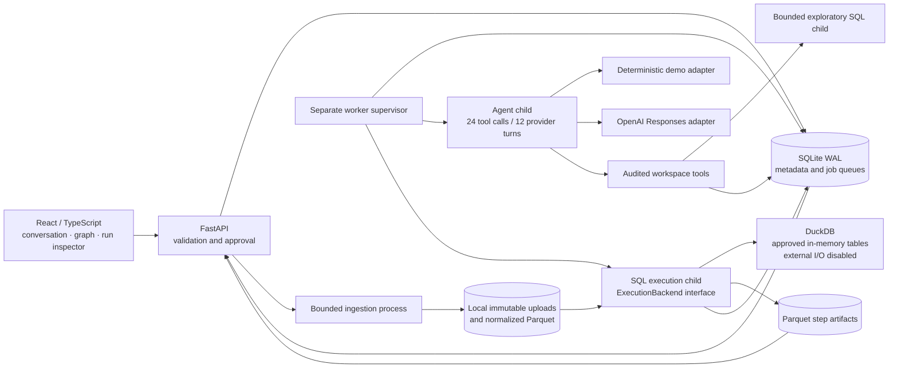

# Architecture and decisions

Tracework is a local, single-user analytical workspace. A pipeline is a recipe;
a run binds that immutable recipe to explicit immutable inputs. The application
never regenerates SQL to rerun a saved version.



## Domain and storage

| Object | Identity and persistence |
| --- | --- |
| Workspace | UUID, name, creation time; workspace filter required on resource endpoints |
| Source | Logical SQL-safe name unique within a workspace; independent of file name |
| Source version | Source + original SHA-256; immutable original bytes, normalization and timestamp |
| Dataset/schema | Physical Parquet path, Arrow schema, row count, column profiles and bounded sample |
| Pipeline | Workspace-owned logical recipe |
| Pipeline version | Immutable spec + SHA-256, increasing version number, optional parent; separate approval |
| Transformation step | Named SELECT, explicit dependencies and check definitions in versioned spec |
| Data-quality check | Query returning violating rows; severity blocking or warning; schema contracts also recorded |
| Run | Exact version ID, input mapping, effective parameters, settings, engine version, request key, states and timestamps |
| Step execution | Per-run state, timestamps and errors; pending downstream steps become skipped |
| Artifact | Run + step → dataset + SHA-256; includes intermediate and failed-check output |
| Finding | Successful run + artifact + exact evidence row/index; derived from materialized results |
| Investigation | Question, provider, proposal/revision, clarification and complete tool request/response history |

```text
.tracework/
  metadata.sqlite             # WAL metadata, queue, approvals, audit
  metadata.sqlite-wal         # may exist while services are running
  uploads/<workspace>/<uuid>/
    original.csv|parquet      # unchanged original; mode 0444
    data.parquet              # normalized typed table; mode 0444
    data.json                 # schema statistics and bounded sample
  runs/<run-id>/<step>.parquet # exact materialized outputs, mode 0444
  worker.lock                 # POSIX exclusive worker lock
```

Metadata transactions use SQLite `BEGIN IMMEDIATE` for claims, IDs, approvals and
version creation. Both run requests with the same workspace/request key and
identical effective payload resolve to one run; reuse with a different payload
is rejected. A new request key explicitly creates a new attempt. Source byte
hashes deduplicate repeated uploads within one logical source. Distinct formats
or byte orderings are distinct input versions even if their contents agree.

SQLite triggers reject updates to source/pipeline versions. Public APIs have no
mutation or deletion routes for these objects. Files are read-only to reduce
accidental changes; an operating-system owner can still modify them. There is no
claim of tamper-proof storage. Failed ingestion may leave unreferenced files for
forensic inspection; automated garbage collection is not implemented.

## Execution and failure semantics

A worker claims one job at a time, starts a separate process, and updates its
heartbeat. Ingestion, exploration, and transformation execution are distinct
code paths. Ingestion reads one app-selected upload. Execution preloads only
mapped workspace inputs as in-memory tables, then disables external access and
locks DuckDB configuration before evaluating SQL.

SQLGlot validates a single query, rejects non-query statements and table
functions, resolves CTE scope, verifies referenced datasets against declared
dependencies, and rejects cyclic/unknown DAG dependencies. SQL does not write
output files: trusted Python saves Arrow results as Parquet. Checks execute after
materialization and before downstream steps. Nonempty blocking checks fail the
attempt; warnings preserve the result. A check that cannot execute fails the run
even if its severity was warning, because its outcome is unknown.

Each pipeline has exact Arrow type/name source contracts. Extra columns are
allowed; required columns and types must match. Schema drift is an inspectable
blocking input check. A source-only rerun can therefore fail before any SQL runs.
Changes to contracts or SQL require a new version and new approval.

Cancellation sets a durable flag; the supervisor kills the child's process group.
CPU/wall deadlines and unexpected child exits produce failed run records. On
restart, a heartbeat older than 15 seconds is failed, never silently replayed.
Executor children also watch for parent death. No exactly-once claim is made for
external side effects: there are no external side effects in the SQL interface.
The at-most-one active local worker is enforced by a POSIX file lock.

`ExecutionBackend` separates `query`, `materialize` and `close` from orchestration.
Only `DuckDBBackend` exists today. A Python backend would need its own process and
security contract; adding `exec()` to the chat layer would violate this boundary.

## Agent and evidence

The real adapter calls the OpenAI Responses API with function tools and
`store=false`. It supports up to 12 provider turns / 24 tool calls and a
150-second job deadline. Recent questions and clarification messages provide
conversation continuity. Every source must be inspected before a plan is accepted.
Pydantic and DAG validation run on both model and manual proposals. Tool errors
are recorded and returned to the model. No tool approves or starts a run.

The deterministic adapter implements only the documented commerce scenario. It
uses actual schema, sampling and exploration tools; its proposal then enters the
same approval, storage and execution path as a real model proposal. It asks for
missing sources or unsupported definitions. The standard repair removes exact
order duplicates and adopts `spend_cents`. It declines to overwrite a recipe whose
steps already contain custom changes. At most two successful repair proposals
can reference one failed run; each needs approval. Failed attempts remain intact.

Findings are generated only when the entire run succeeds. A channel-profit finding
checks the maximum across all output rows of a single currency; generic outputs
receive a neutral result-ready finding. Agent-selected findings store the actual
evidence row, not arbitrary numeric prose. Findings link to artifact, row and
step SQL. This establishes provenance; it does not prove a business assumption.

## Comparisons

Comparison requires runs of the same pipeline. It reports changed source versions,
content hashes, schemas, recipe definitions, parameters and settings. Successful
output comparisons use an explicitly selected unique key and numeric metric,
read complete artifacts, preserve decimal arithmetic and reject mixed currencies.
Absent rows are treated as zero for the metric while before/after rows remain
available in the API. Failed runs still support input/recipe comparison, with a
clear explanation that numeric output comparison is unavailable.

These differences are descriptive. Tracework does not claim causal attribution
of a metric delta to an individual input change. Isolating causes can be done by
explicitly mapping one changed source at a time and saving additional runs.

## Trade-offs

- SQLite and files avoid a queue broker, object store or database server. Back up
  the entire data directory with services stopped; copying only SQLite loses data.
- One worker serializes jobs. This is simple and recoverable, but long runs delay
  investigations. Progress is polled every 1.8 seconds; there is no websocket layer.
- Materializing tables makes reruns and inspection straightforward at local scale.
  It duplicates data and limits usable size. No incremental execution, streaming
  joins, partition caching or distributed execution is implemented.
- The source catalog and profiles are returned together for this small local
  workspace. A large catalog would require paginated metadata endpoints.
- Manual revision uses an editable structured JSON recipe. There is a dependency
  graph, not a drag-and-drop visual SQL builder.

Primary references: [DuckDB security configuration](https://duckdb.org/docs/current/operations_manual/securing_duckdb/overview)
and [OpenAI function calling](https://developers.openai.com/api/docs/guides/function-calling).
